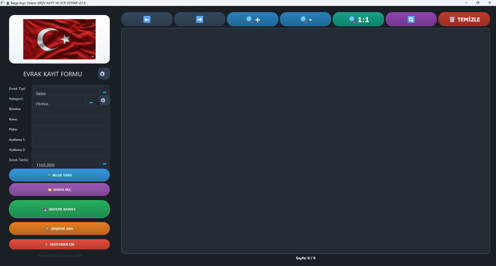
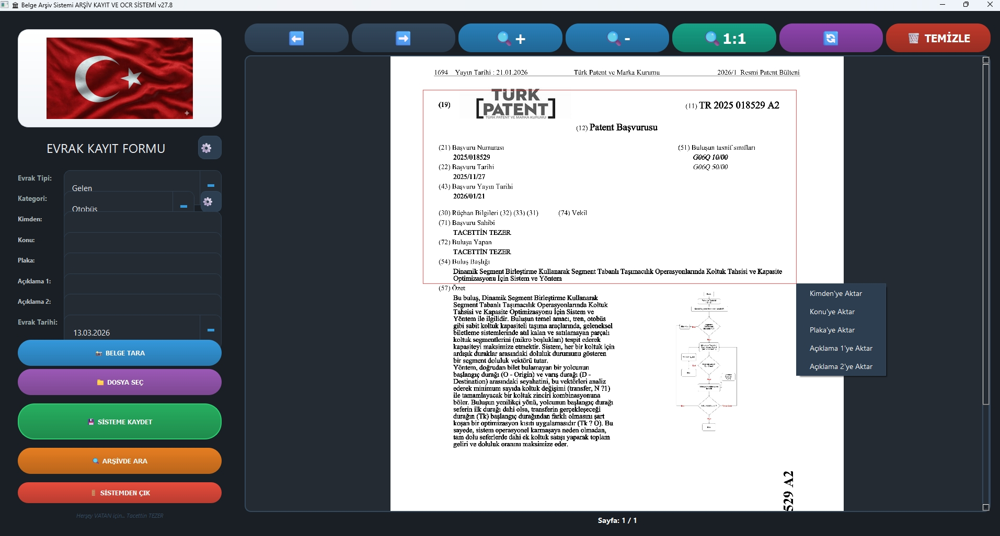
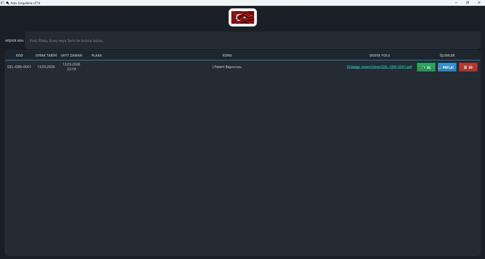

# 🏛️ Belge Arşiv ve OCR Yönetim Sistemi

Modern, karanlık temalı, tam entegre bir **belge yönetim ve arşivleme sistemi**. Tarayıcı entegrasyonu, hibrit OCR motorları, dinamik form yönetimi ve gelişmiş arama özellikleriyle profesyonel belge işleme sağlar.

## 🆕 Son Güncelleme Notları (v27.8)

Bu sürümle birlikte sistem profesyonel bir dağıtım seviyesine ulaştırılmıştır:

-   🚀 **Taşınabilir EXE:** Program artık kurulum gerektirmeyen tek bir `.exe` dosyası olarak çalışır.
-   🛡️ **Maksimum Güvenlik:** Veritabanı sorguları parametreli hale getirilerek SQL Injection riskleri tamamen engellendi.
-   🛠️ **Self-Healing (Kendi Kendine Kurulum):** Eksik klasör ve ayar dosyalarını ilk açılışta otomatik oluşturma özelliği eklendi.
-   ⚖️ **Özel Alan OCR:** Belge üzerinde fare ile seçilen bölgeden OCR yapıp istenen forma aktarma özelliği geliştirildi.
-   📱 **Gelişmiş Paylaşım:** Arşivden WhatsApp ve E-Posta ile doğrudan belge paylaşım özelliği eklendi.
-   ⚖️ **Hukuki Güncelleme:** Proje lisansı **GNU GPL v3** olarak güncellendi.
-   🎨 **Marka Normalizasyonu:** Uygulama genel bir "Belge Arşiv Sistemi" kimliğine kavuşturuldu.


## 📷 Ekran Görüntüleri






## ✨ Ana Özellikler

### 📸 **Tarayıcı Entegrasyonu**
- **Windows WIA Desteği**: Doğrudan tarayıcı cihazlarından belge tarama
- **Otomatik Format Algılama**: JPEG/PNG çıktı formatları
- **Hızlı Tarama**: Tek tıkla yüksek kaliteli tarama
- **Cihaz Seçimi**: Çoklu tarayıcı desteği

### 🔍 **Hibrit OCR Motoru**
- **PDF Belgeler**: Tesseract OCR ile hızlı ve doğru metin çıkarma
- **Fotoğraf ve Tarama**: EasyOCR ile derin öğrenme tabanlı tanıma
- **Türkçe Dil Desteği**: Tam Türkçe karakter seti desteği
- **Görüntü Ön İşleme**: Otomatik kontrast ayarı ve gürültü temizleme
- **Seçmeli OCR ve Akıllı Metin Kaydetme**:
  - Fare ile kırmızı dikdörtgen alan çizerek istediğiniz metni seçin
  - OCR sadece seçtiğiniz bölgeyi tarar
  - Çıkarılan metni doğrudan form alanlarına kaydedin
  - Sistem diğerlerinden farklı olarak standart alanlar yerine sizin seçtiğiniz metni istediğiniz alana kaydeder
  - Kırmızı kutucuğun sağ alt köşesinde kaydetmek istediğiniz alanlar listelenir
  - İstediğiniz alanı seçerek metni otomatik olarak form alanına aktarın

### 🗂️ **Dinamik Form ve Alan Yönetimi**
- **Özelleştirilebilir Alanlar**: Özel alanlar (örneğin: referans numarası, konu, not) ekleme/çıkarma
- **Sıralama ve Düzenleme**: Alanların sırasını ve görünürlüğünü ayarlama
- **Veritabanı Otomasyonu**: Alan değişiklikleri otomatik olarak DB'ye yansır
- **Akıllı Kod Üretimi**: Kategori bazlı benzersiz kod üretimi (örn: GEL-OTO-0001)

### 📝 **Kategori Yönetimi**
- **Dinamik Kategoriler**: Kategorileri ekleme, düzenleme ve silme
- **Hiyerarşik Yapı**: Alt kategoriler ve gruplandırma
- **Kod Çakışma Önleme**: Farklı kategoriler arası kod çakışması engellenir

### 🌙 **Modern Karanlık Arayüz Tasarımı**
- **Midnight Onyx Teması**: Göz yormayan derin koyu renk paleti
- **Glassmorphism Efekti**: Şeffaflık ve derinlik hissi
- **Dinamik Butonlar**: Hover efektleri ve gradient geçişler
- **Responsive Tasarım**: Farklı ekran boyutlarına uyum
- **Kurumsal Mavi Vurgular**: Profesyonel görünüm

### 🔐 **Güvenlik ve Veri Bütünlüğü**
- **SHA-256 Hash Kontrolü**: Mükerrer kayıt engelleme
- **Dosya Damgalama**: Her belgeye sistem kodu ve zaman damgası
- **Transaction Güvenliği**: Veritabanı işlemleri atomik
- **Hata Geri Alma**: Kayıt hatası durumunda dosya temizleme

### 📊 **Gelişmiş Arama ve Sorgulama**
- **Çok Kriterli Arama**: Kod, özel alanlar, konu, tarih ile arama
- **Anlık Sonuçlar**: Yazarken filtreleme
- **Tablo Optimizasyonu**: Yüksek kontrast ve okunaklı tasarım
- **Tıklanabilir Dosya Yolları**: Dosya yoluna tıklayarak klasör açma

### 📤 **Paylaşım ve Entegrasyon**
- **E-Posta Paylaşımı**: Tek tıkla mail taslağı oluşturma
- **WhatsApp Entegrasyonu**: WhatsApp Web ile hızlı paylaşım
- **Klasör Otomasyonu**: Paylaşım için ilgili klasörü otomatik açma
- **Sürükle-Bırak Desteği**: Dosyaları kolayca ekleme

### 🖼️ **Gelişmiş Görüntüleme**
- **PDF ve Görüntü Desteği**: Çoklu format desteği
- **Zoom ve Navigasyon**: Yakınlaştırma, uzaklaştırma, sayfa geçisi
- **Döndürme**: 90° dönüşler
- **Tam Ekran Görüntüleme**: Büyük belgeler için optimize
- **Fare Tekerleği Zoom**: Ctrl+tekerlek ile hızlı zoom

### 📦 **Taşınabilir (Portable) Sürüm**
- **Zero-Setup Experience**: Kurulum gerektirmeyen tek bir EXE dosyası
- **Otomatik Yapılandırma**: İlk çalıştırmada gerekli klasör ve ayar dosyalarını otomatik oluşturur
- **Bağımsız Çalışma**: Python veya kütüphane kurulumu gerektirmez
- **USB Desteği**: Flash bellekten doğrudan çalıştırılabilir

### ⚙️ **Sistem Yönetimi**
- **Konfigürasyon Dosyası**: JSON tabanlı ayarlar
- **Loglama**: Detaylı sistem logları
- **Hata Yönetimi**: Kullanıcı dostu hata mesajları
- **Bellek Optimizasyonu**: Büyük dosyalar için verimli işleme
- **Self-Healing Environment**: Eksik `config.json` veya arşiv klasörlerini otomatik tamir eder

## 🚀 Kurulum ve Çalıştırma

### 1. Hazır Sürüm (Portable - Önerilen)
Hiçbir teknik bilgiye gerek duymadan kullanmak için:
- `dist/Belge_Arsiv_Sistemi.exe` dosyasını indirin ve çalıştırın.
- Program, yanına gerekli dosyaları otomatik olarak oluşturacaktır.

### 2. Geliştirici Sürümü (Kaynak Koddan)

### Sistem Gereksinimleri
- **İşletim Sistemi**: Windows 10/11 (WIA tarayıcı desteği için)
- **Python**: 3.12 veya üstü
- **OCR Motorları**:
  - Tesseract OCR (PDF'ler için)
  - EasyOCR (Fotoğraflar için)
- **Donanım**: Tarayıcı cihazı (opsiyonel)

### Adımlar

1. **Repoyu Klonlayın**:
   ```bash
   git clone https://github.com/ttezer/gelen_giden_evrak.git
   cd gelen_giden_evrak
   ```

2. **Sanal Ortam Oluşturun**:
   ```bash
   python -m venv .venv
   .\.venv\Scripts\activate  # Windows
   ```

3. **Bağımlılıkları Yükleyin**:
   ```bash
   pip install -r requirements.txt
   ```

4. **Tesseract OCR'yi Kurun**:
   - [Tesseract GitHub](https://github.com/tesseract-ocr/tesseract) sayfasından indirin
   - Kurulum sonrası yolu `config.json`'da ayarlayın

5. **Sistemi Başlatın**:
   ```bash
   python main.py
   ```

   Veya `Baslat.bat` dosyasına çift tıklayın.

## 📁 Proje Yapısı

```
bege_sistemi/
├── main.py              # Ana uygulama ve GUI
├── database.py          # SQLite veritabanı yönetimi
├── viewer.py            # Belge görüntüleme ve OCR
├── scanner.py           # WIA tarayıcı entegrasyonu
├── sorgu_sayfasi.py     # Arşiv sorgulama arayüzü
├── utils.py             # Yardımcı fonksiyonlar
├── config.json          # Sistem konfigürasyonu
├── requirements.txt     # Python bağımlılıkları
├── Baslat.bat           # Hızlı başlatma ve paketleme scripti
├── logo.png             # Standart logo
├── dist/                # Dağıatılabilir dosyalar
│   └── Belge_Arsiv_Sistemi.exe # Taşınabilir Tek Dosya
└── Arsiv/               # Belge arşiv klasörü (Otomatik oluşturulur)
    ├── gelen/           # Gelen evraklar
    └── giden/           # Giden evraklar
```

## ⚙️ Yapılandırma

`config.json` dosyasını düzenleyerek sistemi özelleştirin:

```json
{
    "tesseract_path": "C:\\Program Files\\Tesseract-OCR\\tesseract.exe",
    "arsiv_klasoru": "Arsiv",
    "varsayilan_tip": "Gelen",
    "varsayilan_kategori": "Genel",
    "wia_format_guid": "{B96B3CA3-0728-11D3-9D7B-0000F81EF32E}",
    "log_dosyasi": "sistem.log",
    "sirket_adi": "Belge Arşiv Sistemi",
    "logo_dosyasi": "logo.png"
}
```

### Yapılandırma Parametreleri:
- `tesseract_path`: Tesseract OCR yolunu belirtin
- `arsiv_klasoru`: Belge arşiv klasörü adı
- `varsayilan_tip`: Varsayılan evrak tipi (Gelen/Giden)
- `varsayilan_kategori`: Varsayılan kategori
- `wia_format_guid`: Tarayıcı format GUID'i
- `sirket_adi`: Şirket/organizasyon adı
- `logo_dosyasi`: Logo dosya adı

## 📖 Kullanım Kılavuzu

### 1. Belge Kaydı
1. Ana ekranda evrak tipini ve kategoriyi seçin
2. Gerekli alanları doldurun (dinamik alanlar otomatik yüklenir)
3. **"BELGE TARA"** butonuyla tarayıcıdan belge alın veya **"DOSYA SEÇ"** ile mevcut dosyayı yükleyin
4. Sağ panelde belgeyi görüntüleyin ve OCR ile metin çıkarın
5. **"SİSTEME KAYDET"** butonuyla kaydı tamamlayın

### 2. Arşiv Sorgulama
1. **"ARŞİVDE ARA"** butonuna tıklayın
2. Arama kutusuna kod, özel alan veya konu yazın
3. Sonuçlar tabloda listelenecek
4. **"AÇ"** butonuyla belgeyi görüntüleyin
5. **"PAYLAŞ"** menüsünden e-posta veya WhatsApp ile paylaşın
6. Dosya yoluna tıklayarak klasörde gösterin

### 3. Alan Yönetimi
1. Ana ekranda sağ üstteki ⚙️ butonuna tıklayın
2. Yeni alan ekleyin, mevcut alanları düzenleyin veya silin
3. Değişiklikler otomatik olarak kaydedilir

### 4. Kategori Yönetimi
1. Ana ekranda kategori seçim kutusunun yanındaki ⚙️ butonuna tıklayın
2. Kategorileri ekleyin, düzenleyin veya silin

## 🔧 Teknik Detaylar

### Veritabanı Yapısı
- **SQLite** tabanlı ilişkisel veritabanı
- **evraklar** tablosu: Ana belge kayıtları
- **kategoriler** tablosu: Kategori tanımları
- **alan_tanimlari** tablosu: Dinamik form alanları

### OCR Stratejisi
- **PDF Belgeler**: Tesseract ile ön işleme (gri tonlama, kontrast artırma)
- **Fotoğraflar**: EasyOCR ile derin öğrenme tabanlı tanıma
- **Performans Optimizasyonu**: Dosya tipine göre motor seçimi

### Güvenlik Özellikleri
- **Hash Tabanlı Çift Kayıt Engelleme**: Aynı dosyanın tekrar yüklenmesi önlenir
- **Transaction Yönetimi**: Veritabanı tutarlılığı
- **Dosya Damgalama**: Her belgeye benzersiz sistem kodu eklenir

## 🐛 Sorun Giderme

### Yaygın Problemler

**Tarayıcı Çalışmıyor:**
- pywin32 kütüphanesinin yüklü olduğundan emin olun
- Tarayıcı sürücülerinin güncel olduğunu kontrol edin

**OCR Çalışmıyor:**
- Tesseract'ın kurulu ve yolun doğru ayarlı olduğunu kontrol edin
- Türkçe dil paketi kurulu mu? (`tesseract --list-langs`)

**Veritabanı Hatası:**
- `evraklar.db` dosyasının yazılabilir olduğundan emin olun
- Eski veritabanını yedekleyip yeniden oluşturun

**Bellek Hatası:**
- Büyük PDF'ler için sistem RAM'ini kontrol edin
- Dosyayı bölerek işleyin

### Log Dosyası
Tüm hatalar `sistem.log` dosyasına kaydedilir. Sorun bildiriminde bu dosyayı ekleyin.

## 🤝 Katkıda Bulunma

1. Fork edin
2. Feature branch oluşturun (`git checkout -b feature/amazing-feature`)
3. Commit edin (`git commit -m 'Add amazing feature'`)
4. Push edin (`git push origin feature/amazing-feature`)
5. Pull Request açın

### Geliştirme Standartları
- PEP 8 kod stili
- Türkçe yorumlar ve dokümantasyon
- Exception handling zorunlu
- Loglama kullanımı

## 📄 Lisans

Bu proje [GNU GPL v3](LICENSE) altında lisanslanmıştır.

## 📞 İletişim

Sorularınız için issue açabilir veya [ttezer](https://github.com/ttezer) (ttezer@gmail.com) ile iletişime geçebilirsiniz.
